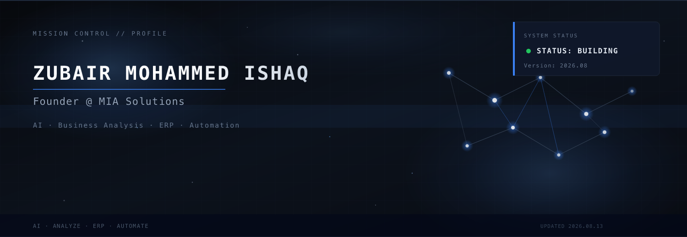
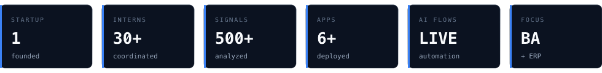
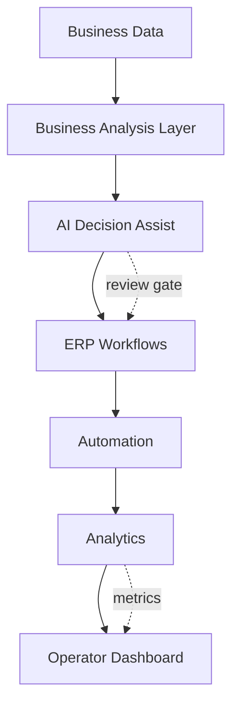
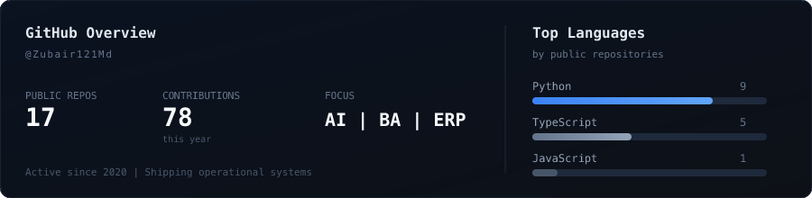

<!--
  Zubair Mohammed Ishaq — Public Operating System
  Profile: https://github.com/Zubair121Md
  Company: MIA Solutions Pvt. Ltd.
  Version: 2026.08
-->

<div align="center">

  

  <br/><br/>

  

  <br/>

  <p>
    <strong>Founder of MIA Solutions</strong><br/>
    <em>Building AI-powered systems for business analysis, ERP, and operations.</em>
  </p>

  <p>
    <code>Founder</code>&nbsp;·&nbsp;<code>AI</code>&nbsp;·&nbsp;<code>Business Analysis</code>&nbsp;·&nbsp;<code>ERP</code>&nbsp;·&nbsp;<code>Automation</code>
  </p>

  <p>
    
    
    
  </p>

  

</div>

---

## Introduction

I’m the founder of **[MIA Solutions](https://miasolutions.in)**, where I build **AI systems for business analysis and ERP** — software that turns messy operations into clear decisions and repeatable workflows.

Over the last year I’ve worked across product, engineering, operations, hiring, customer success, and delivery.

I enjoy solving operational bottlenecks with software — connecting data, analysis, and execution so teams stop running the business from spreadsheets.

```text
priority  →  AI  ›  Business Analysis  ›  ERP  ›  Research  ›  Analytics
identity  →  founder · analyst · builder · operator · engineer
mode      →  ship fast · measure · iterate · document
output    →  AI products · ERP systems · decision infrastructure
```

<div align="center">
  
</div>

---

## Current Mission

```text
┌─────────────────────────────────────────────────────────────┐
│  MIA Solutions                                   v2026.08   │
│  ─────────────────────────────────────────────────────────  │
│                                                             │
│  ├── AI Systems ...................... Decision intelligence│
│  ├── Business Analysis ............... Models · requirements│
│  ├── ERP Automation .................. Workflow engines     │
│  ├── Applied AI ...................... Ops · product layers │
│  ├── Research ........................ Architecture notes   │
│  └── Analytics ....................... Metrics · BI         │
│                                                             │
│  STATUS ▸ BUILDING ●                                        │
│  FOCUS  ▸ AI + BA + ERP for business operations             │
└─────────────────────────────────────────────────────────────┘
```

<div align="center">
  
</div>

---

## Operating Dashboard

| Area | Status | Focus |
|:-----|:-------|:------|
| **AI Systems** | `Building` | Decision intelligence · assisted analysis |
| **Business Analysis** | `Active` | Requirements · models · process design |
| **ERP Automation** | `Active` | Operations · workflow orchestration |
| **Applied AI** | `Shipping` | Product AI layers · ops assistants |
| **Research** | `Writing` | Architecture · publication |
| **Analytics** | `Iterating` | BI · metrics that change decisions |

```text
build timestamp · 2026.08.13
cycle           · continuous
priority        · AI › BA › ERP › research › analytics
```

<div align="center">
  
</div>

---

## Founder Metrics

<div align="center">
  
</div>

| Signal | Value | Context |
|:-------|:------|:--------|
| Startup founded | **1** | MIA Solutions |
| Interns coordinated | **30+** | Hiring · mentoring · delivery |
| Business processes analyzed | **500+** | Leads & ops signals → system design |
| Applications deployed | **Multiple** | AI · ERP · analytics · tools |
| AI systems for BA / ops | **Built** | Decision support · automation |
| ERP systems designed | **Active** | Workflows · cost · inventory |

<div align="center">
  
</div>

---

## Featured Products

### 01 — AI Systems for Business Analysis

**AI that helps analysts and operators make decisions faster.**

Turn fragmented business data into structured analysis — requirements, scoring models, exceptions, and recommended next actions — with humans in the loop.

| | |
|:--|:--|
| **Stack** | Python · LLMs · FastAPI · PostgreSQL · React |
| **Architecture** | [Case study](#case-study--ai-for-business-analysis--erp) |
| **Live** | [miasolutions.in](https://miasolutions.in) |
| **Repos** | [`pharmacy-revenue-app`](https://github.com/Zubair121Md/pharmacy-revenue-app) · [`Buildconnect`](https://github.com/Zubair121Md/Buildconnect) |

---

### 02 — ERP Automation Engine

**Business workflow automation platform.**

Connect operational steps across inventory, finance, and delivery so teams stop chasing status in spreadsheets.

| | |
|:--|:--|
| **Stack** | Python · FastAPI · PostgreSQL · Redis · job queues |
| **Architecture** | Event-driven workflows · cron · API orchestration |
| **Live** | [ppf-qr.vercel.app](https://ppf-qr.vercel.app) |
| **Repo** | [`ERP-for-hybrid-agribusiness`](https://github.com/Zubair121Md/ERP-for-hybrid-agribusiness) · [`ppf-qr`](https://github.com/Zubair121Md/ppf-qr) |

---

### 03 — Applied AI Platform

**AI layers inside real products — not demos.**

Embed assistive AI into operational software: estimates, classification, anomaly flags, and operator copilots with review gates.

| | |
|:--|:--|
| **Stack** | TypeScript · Python · React · FastAPI · AI workflows |
| **Architecture** | Capture → infer → review → write-back → audit |
| **Live** | [b2-b-sooty.vercel.app](https://b2-b-sooty.vercel.app) |
| **Repos** | [`Buildconnect`](https://github.com/Zubair121Md/Buildconnect) · [`B2B`](https://github.com/Zubair121Md/B2B) |

---

### 04 — Research & Analytics

**Architecture notes first, then metrics that matter.**

Research documents how systems should work. Analytics surfaces revenue, pipeline, and operational truth without vanity charts.

| | |
|:--|:--|
| **Stack** | React · FastAPI · PostgreSQL · Redis |
| **Architecture** | Ingest → transform → metrics layer → UI |
| **Live** | [miasolutions.in](https://miasolutions.in) |
| **Repo** | [`pharmacy-revenue-app`](https://github.com/Zubair121Md/pharmacy-revenue-app) · [`Student-System`](https://github.com/Zubair121Md/Student-System) |

<div align="center">
  
</div>

---

## Live Systems

| System | URL |
|:-------|:----|
| **MIA Solutions** | [miasolutions.in](https://miasolutions.in) |
| **B2B platform** | [b2-b-sooty.vercel.app](https://b2-b-sooty.vercel.app) |
| **PPF QR / ops** | [ppf-qr.vercel.app](https://ppf-qr.vercel.app) |

<div align="center">
  
</div>

---

## Case Study — AI for Business Analysis & ERP

### Problem

SMEs run analysis and operations in parallel silos: Excel models, chat threads, and ERP-ish spreadsheets. Analysts rebuild the same views weekly. Exceptions never become product rules. Decisions arrive late.

### Solution

An AI-assisted analysis + ERP loop that:

1. Ingests operational and commercial data  
2. Structures business questions into analysis models  
3. Flags exceptions and recommended actions with AI  
4. Writes approved outcomes into ERP workflows  
5. Reports what changed — for operators and founders  

### Architecture



```text
Data → Business Analysis → AI Assist → ERP → Automation → Analytics → Dashboard
```

### Result

- Analysis tied to executable workflows, not orphan decks  
- Fewer manual rebuilds of the same operational views  
- Clear ownership from insight → action → report  

### Lessons

- AI should compress analysis work, not invent process  
- BA value is in models + exceptions + decisions  
- ERP fails when edge cases are ignored — design for exceptions early  
- Analytics only matter if they change a decision this week  

<div align="center">
  
</div>

---

## Systems I’ve Built

| System | What it does |
|:-------|:-------------|
| **AI decision assist** | Structure questions, score options, surface exceptions |
| **Business analysis models** | Requirements → process maps → system rules |
| **ERP workflows** | Inventory · cost · ops orchestration |
| **Reporting automation** | Scheduled metrics without manual rebuilds |
| **Business dashboards** | Revenue, ops, and analytical visibility |
| **API integrations** | Glue between tools, data sources, and jobs |
| **Internal ops tools** | Hiring coordination, campus systems, POS |
| **Applied AI layers** | Estimates, classification, operator copilots |

```text
principle · if analysis repeats weekly, it should become software
```

<div align="center">
  
</div>

---

## Technical Capabilities

### AI Systems
- Decision-assist workflows with human review loops  
- Business-analysis copilots (structure, score, exception flags)  
- Retrieval-assisted operational assistants  
- Applied AI inside ERP and product surfaces  

### Business Analysis
- Requirements → process maps → system rules  
- KPI and metric design for operators  
- Exception and edge-case modeling  
- Translating business pain into product scope  

### Automation
- Workflow design and process mapping  
- Background jobs and queue workers  
- Cron systems and scheduled pipelines  
- API orchestration across SaaS and internal services  
- Business process automation for SMEs  

### Backend
- FastAPI / Python services  
- PostgreSQL modeling and migrations  
- Auth, roles, and multi-tenant patterns  
- Redis caching and job coordination  

### Frontend
- React / Next.js product UI  
- Operator dashboards and dense data views  
- Form-heavy BA / ERP flows  
- Clear information hierarchy for non-technical users  

### Data
- ETL-style ingest from Excel / APIs  
- Metric layers for revenue and pipeline  
- BI dashboards people actually use  
- Data cleanup and standardization for decisions  

### Cloud
- Deployable app stacks (API + UI + DB)  
- Environment configuration and secrets hygiene  
- Offline-capable patterns where networks fail  
- Observability basics: logs, health, failures  

### Operations
- Founder-led delivery across product and GTM  
- Intern coordination and mentorship at scale  
- Customer success feedback → roadmap loops  
- Documentation as an operating asset  

<div align="center">
  
</div>

---

## GitHub Analytics

Self-hosted snapshot (no third-party widgets).

<div align="center">
  
</div>

<br/>

| Metric | Value |
|:-------|:------|
| Public repositories | **17** |
| Contributions (this year) | **78** |
| Primary languages | **Python** · **TypeScript** · JavaScript |
| Focus | **AI** · **Business Analysis** · **ERP** |
| Active since | **2020** |

```text
source · local assets/analytics.png
note   · third-party stats hosts removed (unreliable / paused)
```

<div align="center">
  
</div>

---

## Build in Public

I treat GitHub as a **public engineering journal**.

Every meaningful project, experiment, automation, and system I build is documented.

The goal is not perfect code.

The goal is continuous execution.

```text
ship → learn → write → ship again
```

<div align="center">
  
</div>

---

## Writing

| Essay | Theme |
|:------|:------|
| **What building a startup taught me about execution** | Speed · ownership · focus |
| **Designing operational systems for SMEs** | Process → product |
| **AI is replacing workflows, not people** | Augmentation · guardrails |
| **Business analysis as a product discipline** | Models · exceptions · decisions |
| **Why founders should learn engineering** | Leverage · taste · truth |

> Writing lives alongside shipping. Drafts → public notes → product decisions.

<div align="center">
  
</div>

---

## Open Source

- AI systems for business analysis and decisions  
- ERP utilities and workflow engines  
- Analytics and BI experiments  
- Developer tooling for faster delivery  
- Internal productivity systems (campus, POS, ops)  

Pinned repositories prioritize **AI, BA, ERP, research, analytics**.

See [`docs/PINNED_REPOS.md`](./docs/PINNED_REPOS.md).

<div align="center">
  
</div>

---

## Contact

<div align="center">

  <a href="https://miasolutions.in">
    
  </a>
  &nbsp;
  <a href="https://www.linkedin.com/company/miasolutions/">
    
  </a>
  &nbsp;
  <a href="https://github.com/Zubair121Md">
    
  </a>
  &nbsp;
  <a href="mailto:contact@miasolutions.in">
    
  </a>

</div>

<br/>

```text
┌──────────────────────────────────────────┐
│  Zubair Mohammed Ishaq                   │
│  Founder · MIA Solutions                 │
│                                          │
│  Building AI systems for                 │
│  business analysis, ERP, and ops.        │
│                                          │
│  → https://miasolutions.in               │
│  → contact@miasolutions.in               │
└──────────────────────────────────────────┘
```

---

<div align="center">

  

  <p>
    <sub>
      <code>public operating system</code> · <code>v2026.08</code> · <code>built to ship</code>
    </sub>
  </p>

  <p>
    <sub>© 2026 Zubair Mohammed Ishaq · MIA Solutions Pvt. Ltd.</sub>
  </p>

</div>
