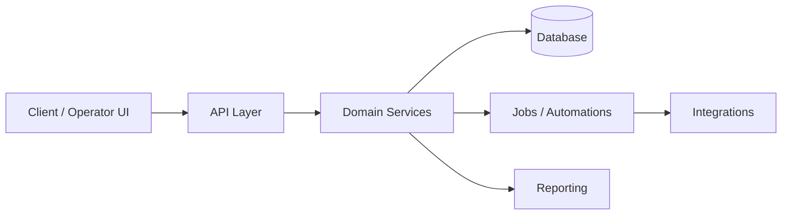

<!--
  MIA Solutions — Repository README Template
  Copy this file into any product/repo as README.md
  Replace all {{PLACEHOLDERS}} before publishing.
-->

<div align="center">

  <!-- Optional: add ./assets/hero.svg or a product screenshot -->
  <!--  -->

  <h1>{{PRODUCT_NAME}}</h1>

  <p><strong>{{ONE_LINE_VALUE_PROPOSITION}}</strong></p>

  <p>
    
    
    
  </p>

  <p>
    <a href="{{DEMO_URL}}">Demo</a> ·
    <a href="{{DOCS_URL}}">Docs</a> ·
    <a href="mailto:contact@miasolutions.in">Contact</a>
  </p>

</div>

---

## Overview

{{2_4_SENTENCES_WHAT_THIS_IS_AND_WHO_IT_IS_FOR}}

```text
product   · {{PRODUCT_NAME}}
owner     · MIA Solutions / Zubair Mohammed Ishaq
mode      · {{building|active|maintained}}
updated   · {{YYYY.MM.DD}}
```

---

## Problem

{{Describe the operational pain without jargon.}}

- {{Pain point 1}}
- {{Pain point 2}}
- {{Pain point 3}}

---

## Solution

{{How this product removes the bottleneck.}}

1. {{Capability 1}}
2. {{Capability 2}}
3. {{Capability 3}}

```text
input → process → output → feedback loop
```

---

## Architecture



### Components

| Layer | Responsibility |
|:------|:---------------|
| UI | Operator workflows, dashboards, forms |
| API | Auth, validation, domain endpoints |
| Services | Business rules and orchestration |
| Data | Persistence, migrations, queries |
| Jobs | Schedules, queues, async work |
| Integrations | External APIs and webhooks |

---

## Tech Stack

| Area | Choices |
|:-----|:--------|
| Frontend | {{e.g. React / Next.js / TypeScript}} |
| Backend | {{e.g. FastAPI / Python}} |
| Data | {{e.g. PostgreSQL / Redis}} |
| AI | {{e.g. LLM workflows / embeddings}} |
| Infra | {{e.g. Docker / Vercel / VPS}} |

---

## Screenshots

<!-- Add real screenshots; avoid mock clutter -->

| View | Description |
|:-----|:------------|
| `./docs/screenshots/01-dashboard.png` | Primary operator view |
| `./docs/screenshots/02-workflow.png` | Core workflow |
| `./docs/screenshots/03-report.png` | Reporting surface |

---

## API

Base URL: `{{API_BASE_URL}}`

### Auth

```http
Authorization: Bearer {{TOKEN}}
```

### Core endpoints

| Method | Path | Purpose |
|:-------|:-----|:--------|
| `GET` | `/health` | Health check |
| `GET` | `/v1/{{resource}}` | List |
| `POST` | `/v1/{{resource}}` | Create |
| `PATCH` | `/v1/{{resource}}/:id` | Update |

```bash
curl -s "{{API_BASE_URL}}/health"
```

---

## Deployment

### Local

```bash
# Backend
cd backend
python -m venv .venv && source .venv/bin/activate
pip install -r requirements.txt
uvicorn main:app --reload --port 8000

# Frontend
cd frontend
npm install
npm run dev
```

### Environment

```bash
cp .env.example .env
# Fill: DATABASE_URL, API keys, APP_URL
```

### Production checklist

- [ ] Secrets not committed  
- [ ] Migrations applied  
- [ ] Health endpoint green  
- [ ] Backups configured  
- [ ] Error logging enabled  

---

## Roadmap

| Phase | Focus | Status |
|:------|:------|:-------|
| P0 | Core workflow usable end-to-end | {{todo/doing/done}} |
| P1 | Automations + integrations | {{todo/doing/done}} |
| P2 | Analytics + operator polish | {{todo/doing/done}} |
| P3 | Scale, reliability, docs | {{todo/doing/done}} |

---

## Results

{{Quantify carefully — no exaggeration.}}

- {{Metric or qualitative outcome 1}}
- {{Metric or qualitative outcome 2}}
- {{Metric or qualitative outcome 3}}

---

## Lessons Learned

- {{Lesson about product / users}}
- {{Lesson about architecture}}
- {{Lesson about execution}}

```text
write the lesson while the scar is fresh
```

---

## License & Contact

Built by **[Zubair Mohammed Ishaq](https://github.com/Zubair121Md)** · **[MIA Solutions](https://miasolutions.in)**

- Website: https://miasolutions.in  
- Email: contact@miasolutions.in  
- GitHub: https://github.com/Zubair121Md  

---

<div align="center">
  <sub><code>{{PRODUCT_NAME}}</code> · <code>v{{VERSION}}</code> · part of the MIA public operating system</sub>
</div>
